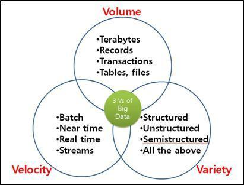

### BIG DATA
#### no-sql의 개념이해에 딱 필요한 만큼만 진행하도록 하겠습니다.

---

#####1. 빅데이터의 출현배경
최근 2년간 생상된 데이터가 인류가 지금까지 생산한 데이터보다 양이 많다고 합니다. 스마트폰과 같은 디지털 기기의 보급과 소셜네트워크서비스(SNS)의 부상으로 엄청난 양의 데이터가 생산되고 있습니다.

스토리지 전문기업인 EMC가 발표한 자료에 따르면, 2011년에 전 세계에서 생성된 디지털 데이터의 양은 1.8 제타바이트(ZB)에 이릅니다. 1.8 ZB는 약 1조 8천억 기가바이트(GB)에 해당 하는 수치입니다. 이는 우리나라 전 국민이 18만년 동안 쉬지 않고, 1분마다 트위터 글을 3개씩 게시하는 것이나 마찬가지 입니다. 또한 2시간이 넘는 HD 영화 2000억편을 한 사람이 쉬지 않고 4천700만년 동안 시청할 분량에 해당합니다. 이를 32GB 아이패드에 저장할 경우에는 575억개의 아이패드가 필요하고, 이는 서울 면적의 2.1배에 해당하는 수량입니다. 이러한 데이터는 앞으로도 매년 2배 이상씩 증가할 것이라고 예상되고 있습니다.

---

#####2. 빅데이터란?
문자 그대로 사이즈가 큰 데이터를 빅 데이터라고 하는 것일까? 사실 지금까지 빅 데이터의 정의에 대해서 명확하게 합의가 된 적은 없었습니다. 세계적인 컨설팅 기관인 맥킨지와 IDC에서는 다음과 같이 빅 데이터를 정의하였습니다.

> 데이터의 규모에 초첨을 맞춘 정의
기존 데이터 베이스 관리도구의 데이터 수집, 저장, 관리, 분석하는 역량을 넘어서는 데이터 – 맥킨지 2011년 6월

> 업무 수행 방식에 초점을 맞춘 정의
다양한 종류의 대규모 데이터로부터 저렴한 비용으로 가치를 추출하고, 데이터의 빠른 수집, 발굴, 분석을 지원하도록 고안된 차세대 기술 및 아키텍처 – IDC 2010년 4월

> 빅 데이터(영어: big data)란 기존 데이터베이스 관리도구로 데이터를 수집, 저장, 관리, 분석할 수 있는 역량을 넘어서는 대량의 정형 또는 비정형 데이터 집합 및 이러한 데이터로부터 가치를 추출하고 결과를 분석하는 기술을 의미한다 [- wikipedia](http://ko.wikipedia.org/)

즉, 이전에는 버려지거나 관리해서 분석할 수 있는 대상이 아니었던 데이터를 사용하게 된 것이 빅 데이터의 시작이다.
데이터베이스 관리 도구(DBMS)에 저장하지 않았던 혹은 못했던 데이터 라고도 생각할 수 있다.
(데이터의 양이 많아서 일수도, 형태가 일정하지 않아 못했던 것일수도 있음)

---

#####3. 빅데이터의 3대요소
빅 데이터의 3대 요소(3V)란 크기(Volume), 속도(Velocity), 다양성(Variety)를 의미하며, 각 요소는 다음과 같이 특징을 가지고 있습니다.

 
* 크기(Volume)

비즈니스 특성에 따라서 다를 수 있지만, 일반적으로 수십 테라 혹은 수십 페타 바이트 이상이 빅 데이터의 범위에 해당합니다. 이러한 빅 데이터는 기존 파일 시스템에 저장하기 어려울 뿐만 아니라, 데이터 분석을 위해서 사용하는 BI/DW 같은 솔루션에서 소화하기 어려울 정도로 급격하게 데이터 양이 증가하고 있습니다. 이러한 문제를 극복하기 위해서는 확장 가능한 방식으로 데이터를 저장하고, 분석하는 분산 컴퓨팅 기법으로 접근해야 합니다. 현재 분산 컴퓨팅 솔루션에는 구글의 GFS, 아파치의 하둡, 대용량 병렬 처리 데이터 베이스로는 EMC의 GreenPlum, HP의 Vertica, IBM의 Netezza, 테라데이터의 Kickfire 등이 있습니다.

* 속도(Velocity)

빅 데이터의 속도적인 특징은 크게 실시간 처리와 장기적인 접근으로 나눌 수가 있습니다. 우리는 매일 매 순간 데이터를 생산하고 있습니다. 교통카드로 지하철과 버스를 이용할 때도 교통비와 탑승위치를 남기고, 금융 거래를 할 때도 금융 기관의 데이터 베이스에 데이터를 만들게 됩니다. 인터넷 검색을 할 때도 모든 검색어가 저장이 되고, 쇼핑몰이나 포털 사이트 같은 곳을 이용할 때도 우리가 클릭한 이력이 모두 저장됩니다. 스마트폰에서 SNS나 지도 같은 앱을 이용할 때도 우리의 위치 정보를 남기게 됩니다. 이와 같이 오늘날 디지털 데이터는 매우 빠른 속도로 생성이 되기 때문에 데이터의 생산, 저장, 유통, 수집, 분석이 실시간으로 처리되어야 합니다. 예를 들어 게임의 채팅창에서 누군가 불건전한 내용을 입력할 경우, 시스템에서 이러한 문구를 바로 분석해서 다른 사용자에게 피해가 없도록 조치를 해야 합니다. 또한 온라인 쇼핑몰에서 고객이 책을 주문할 경우, 주문한 책과 유사한 장르나 비슷한 성향의 고객이 구입한 책을 추천 한다면 매출을 늘리는데 도움이 될 것입니다. 물론 모든 데이터가 실시간 처리만을 요구한 것은 아닙니다. 수집된 대량의 데이터를 다양한 분석 기법과 표현 기술로 분석을 해야 하는데, 이는 장기적이고 전략적인 차원에서 접근할 필요가 있습니다. 통계학과 전산학에서 사용되던 데이터 마이닝, 기계 학습, 자연어 처리, 패턴 인식 등이 분석 기법에 해당합니다. 

* 다양성(Variety)

다양한 종류의 데이터들이 빅 데이터를 구성하고 있습니다. 데이터의 정형화의 종류에 따라서 정형(Structured), 반정형(Semi-Structured), 비정형(Unstructed)로 나눌 수 있습니다. 정형 데이터는 문자 그대로 정형화된 데이터로, 고정된 필드에 저장되는 데이터를 의미합니다. 예를 들어 우리가 온라인 쇼핑몰에서 제품을 주문할 때 이름, 주소, 연락처, 배송주소, 결제정보 등을 입력한 후 주문을 하면 데이터 베이스에 미리 생성되어 있는 테이블에 저장됩니다. 이때 테이블은 고정된 필드들로 구성이 되는데, 이렇게 일정한 형식을 갖추고 저장되는 데이터를 정형 데이터라고 합니다. 정형 데이터는 기존의 솔루션을 이용하여 비교적 쉽게 보관, 분석, 처리 작업을 진행할 수 있습니다. 반정형 데이터는 고정된 필드로 저장되어 있지는 않지만, XML이나 HTML같이 메타 데이터나 스키마 등을 포함하는 데이터를 의미합니다. 비정형 데이터란 고정된 필드에 저장되어 있지 않은 데이터를 의미합니다. 유투부에서 업로드하는 동영상 데이터, SNS나 블로그에서 저장하는 사진과 오디오 데이터, 메신저로 주고 받은 대화 내용, 스마트폰에서 기록되는 위치 정보, 유무선 전화기에서 발생하는 통화 내용 등 다양한 비정형 데이터가 존재합니다. 빅 데이터는 이러한 비정형 데이터도 처리할 수 있는 능력을 갖추어야 합니다.

[출처: BLRUNNER.COM](http://blrunner.com/12)

---

#####4. 빅데이터기술
빅 데이터 기술은 크게 보아, 빅데이터 저장 기술, 빅데이터 정제 기술, 빅데이터 분석/가시화 기술, 빅데이터 기반 예측 기술로 나눌 수 있습니다.
빅데이터 저장 기술 자체는 이미 구글과 야후 등에 의해 요소 기술로서는 상당한 완성도에 달해 있고, 저장 단가의 절감, 자료 저장/인출 속도의 향상, 저장 신뢰도/안정성의 보장 등이 이슈가 됩니다.
공개소스로 Hadoop의 HDFS/HBASE, Cassandra, MongoDB 등이 유명하고, 우리나라 전자통신연구원(ETRI)의 GloryFS 등 많은 솔루션들이 존재합니다.

빅 데이터 분석/가시화 기술은 대부분 통계학이나 데이터 마이닝이나 OLAP(OnLine Analytical Processing)이라 부르는 분야의 일입니다. 원체 오래된 학문 분야이고 완성도가 높습니다만, 얘기했다시피 빅데이터가 “전수분석”을 암묵적으로 전제하는 기술이라서 시간을 단축하고 정확도를 높이기 위한 연구와, 축적된 학문적 연구들을 현실에 적용하는 컨설팅이나 상품화 자체에 많은 가능성이 열려 있습니다.
이 분야의 최강자는 세계 최고의 통계 분석 패키지를 내놓는 "꿈의 S/W 회사" SAS와 그 제품군입니다만, 최근 무료 공개 소프트웨어이면서 적용 범위와 완성도가 드라마틱하게 높아져 교육계, 학계에서 표준으로 자리를 잡아가고 있는 'R'이 있습니다.

빅 데이터 분석도 매우 많은 시간이 걸리는 작업인 만큼, 빅데이터 정제와 더불어 분산 병렬 처리 적용 대상 분야입니다. 말씀 드렸다시피, 빅데이터가 요즘 뜨게 된 중요한 이유가, "유의미한 시간에 대규모(전수) 데이터 정제/분석이 가능"해졌기 때문인데, 이것은 구글이 제시한 Map-Reduce 프로그래밍 모델이 보급되었기 때문입니다. 
맵 리듀스라는 것은 간단히 말해, 빅데이터를 나누어 저장하고 있는 수백, 수천대의 서버 각각에서, 자기가 저장하고 있는 데이터에 대한 정제/분석(Map)을 할 수 있는대로 해서, 그 결과값을 모아 최종 정제/분석 결과를 내는(Reduce) 방법입니다. 혼자하면 100분 걸릴 것, 100명이 하면 1분 걸리는 것이죠. 이런 것을 분산 병렬 처리라고 합니다.

[출처: 빅데이터란 무엇인가?(1) - 의미와 배경|작성자 안빈낙도](http://blog.naver.com/hyntel/50139299783)

