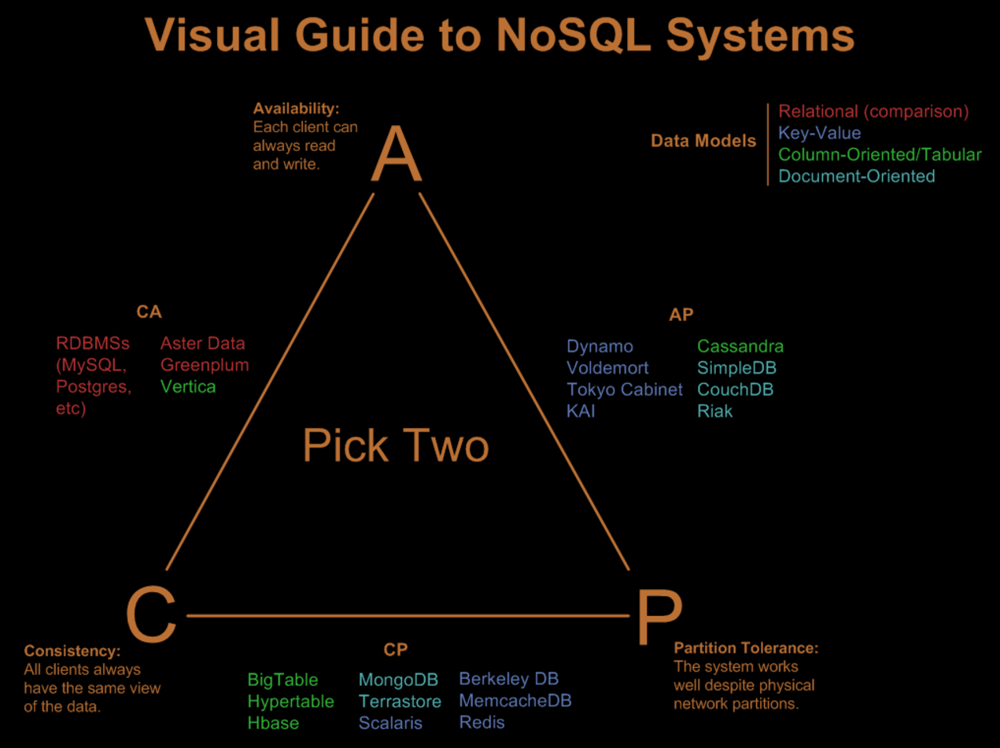
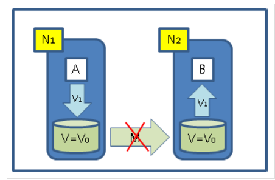

# no-Sql

### part1. no-sql? (탄생배경과 기본개념)

#### 1. CAP이론

* NO SQL 이란? 
NoSQL이 무엇의 약자인지는 사람에 따라 NoSQL, Not Only SQL, Non-Relational Operational Database SQL로
 
엇갈리는 의견들이있지만, 현재 Not Only SQL로 풀어 설명하는 것이 다수를 차지하고 있다.
  

* CAP Theorem 1
NoSQL에 대해서 이해하려면 먼저 CAP 이론에 대해서 알 필요가 있다.
 
CAP이론은 Brewer's CAP Theorem으로 알려져 있는데 분산 컴퓨팅 시스템에서 보장해야 하는 특징으로 아래 3가지를 정의하고 있다.

> Consistency (일관성) : 모든 노드들은 동시에 같은 데이터를 보아야 한다.
 
모든 노드가 같은 시간에 같은 데이터를 보여줘야 하며, 저장된 데이터까지 모두 같을 필요는 없음.
 
쓰기 동작이 완료된 후 발생하는 읽기 동작은 마지막으로 쓰여진 데이터를 리턴해야 한다는 것을 의미.

> Availability (유효성) : 모든 노드는 항상 읽기와 쓰기를 할 수 있어야 한다.
 
특정 노드가 장애가 나도 서비스가 가능해야 한다"라는 의미, "저장실패" 또는 "읽기 불가"라는 데이터를 리턴을 하는 경우도
 
오류가 아닌 성공적인 리턴이라 판단.

> Partition Tolerance (파티션 허용차) : 시스템은 물리적인 네트워크 파티션을 넘어서도 잘 동작해야 한다

CAP 이론에 따르면 위 3가지 중에 동시에 2가지만 보장할수 있고 3개를 모두 보장하는 것이 불가능하다.
 
그래서 데이터를 관리할때 이 3가지 중에 어느 2가지에 중점을 두냐는 것은 아주 중요한 부분이다.
 

> Nathan Hurst - Visual Guide to NoSQL Systems
기존에 많이 사용하던 RDBMS는 3가지 중 CA에 집중하고 있다.
 
웹이 발전하면서 다양한 요구사항이 생겨나고 엄청난 양의 데이터를 처리해야 하게 되면서
 
RDBMS가 갖지 못한 P의 특성이 필요해졌고 그러면서 등장한 것이 NoSQL이다.
 
(데이터베이스에 대한 수평적 확장에 대한 이슈가 발생했고 확장성이슈를 해결하기 위해서 P를 선택하다 보니
 
기존에 가지고 있던 C나 A의 특성중 하나를 포기해야 했다.)
 
그래서 NoSQL에는 다양한 시도들이 있지만 가장 중요한 이슈는 확장성을 해결하려는 것으로 생각된다.
 
관계형 데이터베이스는 기본적으로 분산형을 고려해서 디자인 되지 않아서
 
ACID(원자성, 일관성, 독립성, 지속성) 트랜잭션 같은 추상화와 고레벨 쿼리모델을 풍부하게 제공할 수 있지만
 
확장성이 좋지 못하기 때문에 모든 NoSQL 데이터베이스는 다양한 방법으로 확장성 이슈를 해결하기 위해 초점을 맞추고 있다.
 
각 NoSQL에는 여러가지 차이점들이 있지만 CAP의 범주에서만 보면 CP를 선택하거나 AP를 선택하게 된다.

* CAP Theorem 2

** "C"가 꼭 필요한 상황인 경우 **
- A가 V1이라고 썼기 때문에 B는 V1이라고 읽을 수 있어야만 한다.
- A의 쓰기 동작은 M이 복구되기 전까지는 성공할 수 없다.
- M이 복구되기 전까지는 A의 Write는 block되거나 실패해야 한다. = Availability가 없음 = CP
- M이 문제가 생길 수 없도록 구성 = Partition-Tolerance가 필요 없음 = CA

** "A"가 꼭 필요한 상황인 경우 **
- 어떤 경우에도 서비스가 Unavailable하면 안된다.
- A와 B가 꼭 동일한 데이터를 읽을 필요는 없음 = AP
- M이 문제가 생길 수 없도록 구성 = Partition-Tolerance가 필요 없음 = CA

** "P"가 꼭 필요한 상황인 경우 **
- 메시지 전달 과정(M)에서 문제가 생기더라도 시스템에 영향이 가서는 안된다.
- A와 B가 꼭 동일한 데이터를 읽을 필요는 없음 = AP
- A의 쓰기 동작은 M이 복구되기를 기다린다. = 그동안 쓰기 서비스 불가능 = Availability가 없음 = CP

